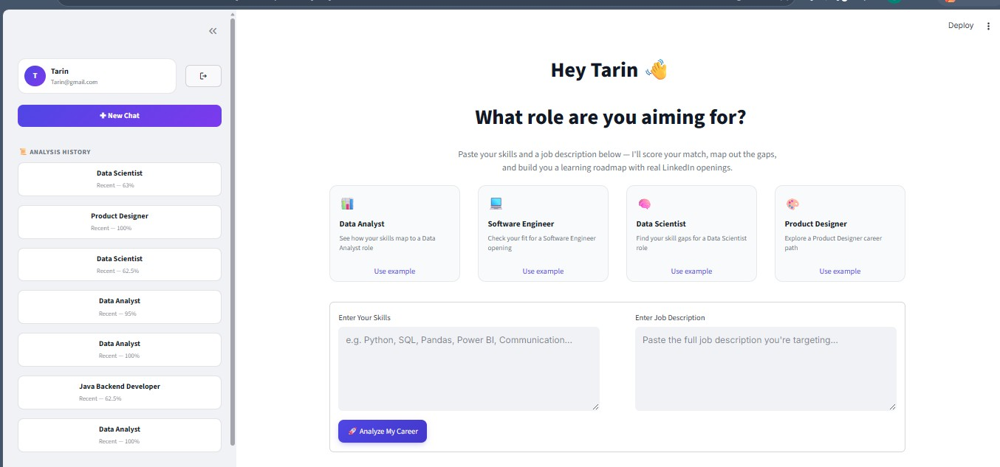
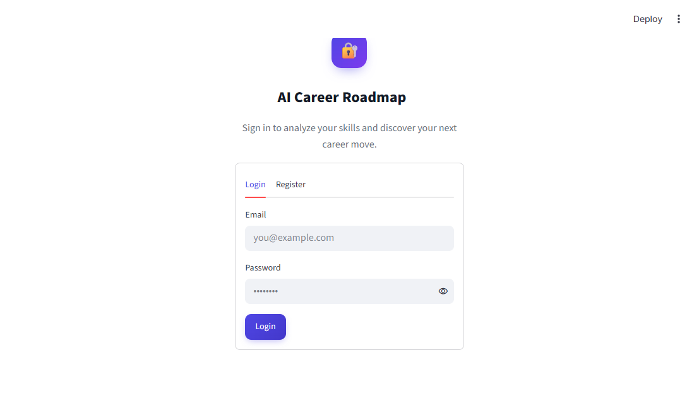
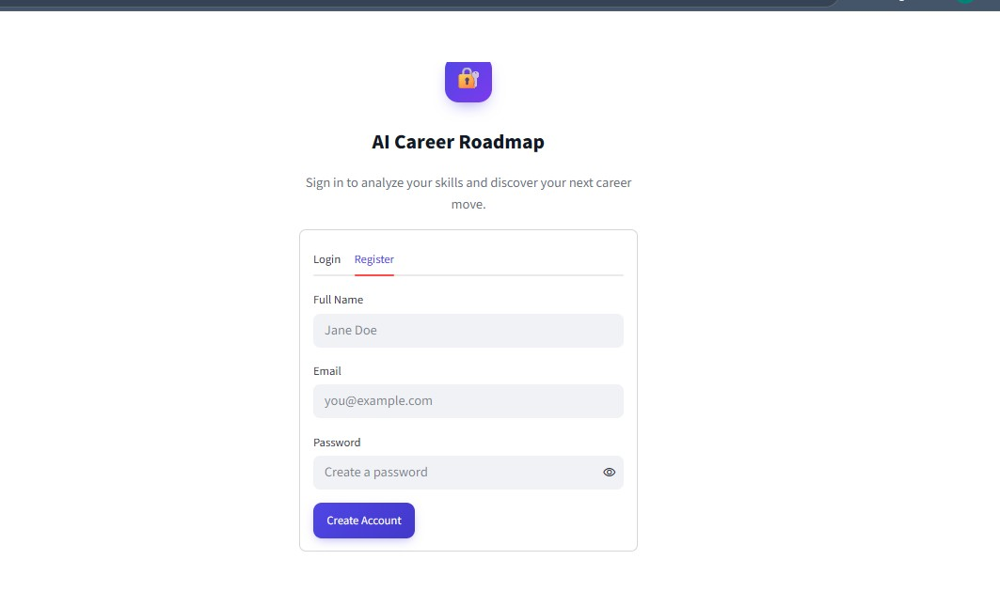
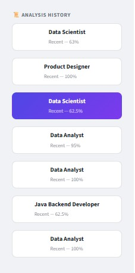
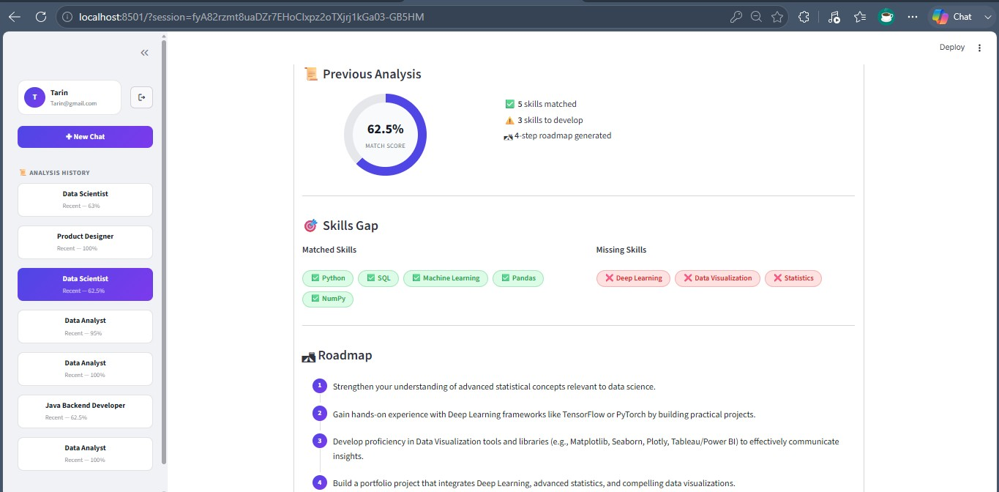
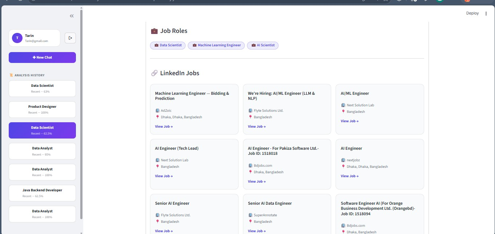

# 🤖 AI-Powered Job Skill Gap Analyzer & Career Roadmap Generator

An AI-powered career guidance platform that helps users analyze their skills against a target job role, identify skill gaps, generate personalized career roadmaps, and discover relevant job opportunities.

## 📸 Project Preview

### 🏠 Home Page

The home page allows users to enter their current skills and a target job description to analyze their career fit.

### 🔐 Login

Secure user login for accessing personalized career analysis and saved history.

### 📝 Registration

Users can create an account to access the platform and save their career analyses.

### 📊 Analysis History

Users can view their previous career analyses, including different job roles and match scores.

### 💼 LinkedIn Job Recommendations

The system provides relevant job opportunities based on the analyzed career path and recommended roles.

